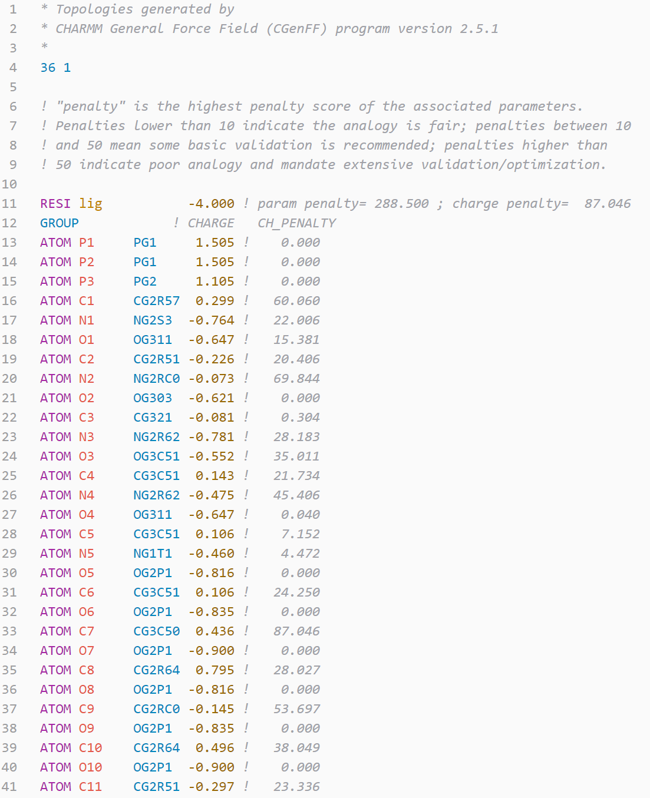
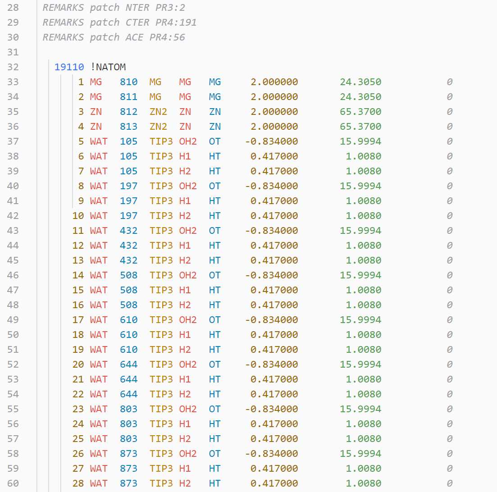
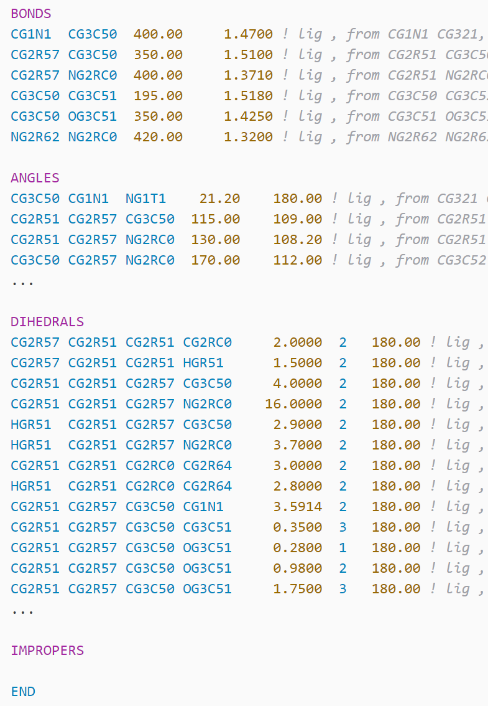

# md-highlighter README

`md-highlighter` is a simple extension to highlight files about molecular modeling and dynamics simulation. Specially, it supports NAMD/CHARMM format files.

## Features

Supported format: 

- NAMD: rtf, pdb, prm, psf, str, inp
- Amber: in
- small molecule: sdf, mol2 (modified from gromacs helper), ...

For gromacs-related files, please install `gromacs-helper`. For VMD, install `TCL`. For Gaussian, install `Gaussian Input File (gjf)`. But maybe I'll make my own syntaxes.

Tested in theme "Atom One Light".

## Gallery

.pdb file

NAMD/CHARMM .rtf file

NAMD/CHARMM .psf file

NAMD/CHARMM .prm file

## Known Issues

- PDB: recognize lines starting with ATOM or HETATM by `"begin"` and `"end"`
- PSF: ATOM and BOND is not highlighted (MOL2: similar). Be careful that psf formats in vmd and charmm-gui are different
- RTF: the structure depiction after ! is italic...
- MOL2: number of atoms/bonds

TODO:

- add self-defined colors for aminoacids types (polar, nonpolar, etc.)

## Release Notes

see CHANGELOG

## For more information

Welcome to contact me for any problems: [gxf1212@zju.edu.cn](mailto:gxf1212@zju.edu.cn)

**Enjoy!**
